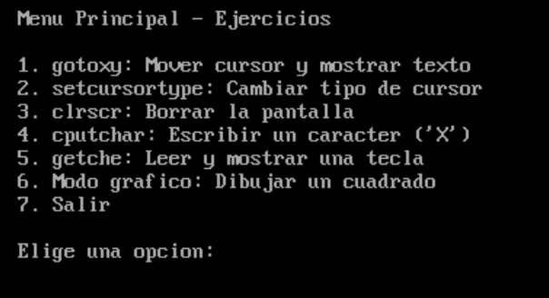
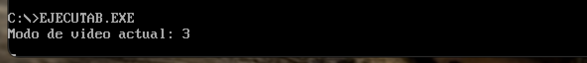
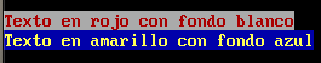
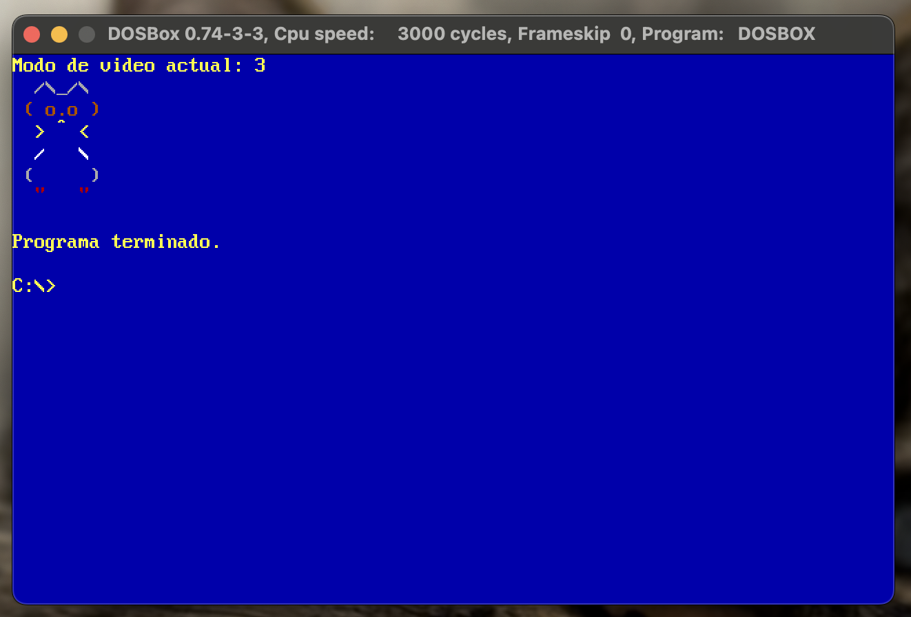
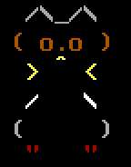

# PDIH_UGR

## Práctica 1. Entrada/Salida utilizando interrupciones con lenguaje C

## Autores:
- William Quinn
- Laura Riesco

> **Nota:**
> Realizado con una division de 5 funciones basicas cada uno + 1 extra. De ahi que haya 2 archivos .c

## Funciones básicas

### 1. `gotoxy()`
Coloca el cursor en una posición determinada.

---

### 2. `setcursortype()`
Fija el aspecto del cursor, debe admitir tres valores: INVISIBLE, NORMAL y GRUESO.

- Menu inicial para los tipos de cursores
- 
- Cursor invisible
- 
- Cursor normal
- 
- Cursor ancho
- 

---

### 3. `setvideomode()`
Fija el modo de video deseado.

---

### 4. `getvideomode()`
Obtiene el modo de video actual.

---

### 5. `textcolor()`
Modifica el color de primer plano con que se mostrarán los caracteres.

---

### 6. `textbackground()`
Modifica el color de fondo con que se mostrarán los caracteres.

---

### 7. `clrscr()`
Borra toda la pantalla.

---

### 8. `cputchar()`
Escribe un carácter en pantalla con el color indicado actualmente.

---

### 9. `getche()`
Obtiene un carácter de teclado y lo muestra en pantalla.

---

### 10. `pixel()`
Dibuja un pixel en modo gráfico (la función recibirá la coordenada x, y y el color del punto).

---

## Funciones extra

### 11. Dibujar un recuadro
Implementa una función que permita dibujar un recuadro en la pantalla en modo texto. Recibe como parámetros las coordenadas superior izquierda e inferior derecha del recuadro, el color de primer plano y el color de fondo.

---

### 12. ASCII Art
Implementa un programa sencillo que realice un dibujo sencillo de tipo “ASCII art”. En el ANEXO al final de este guión se proponen algunos diseños.

---