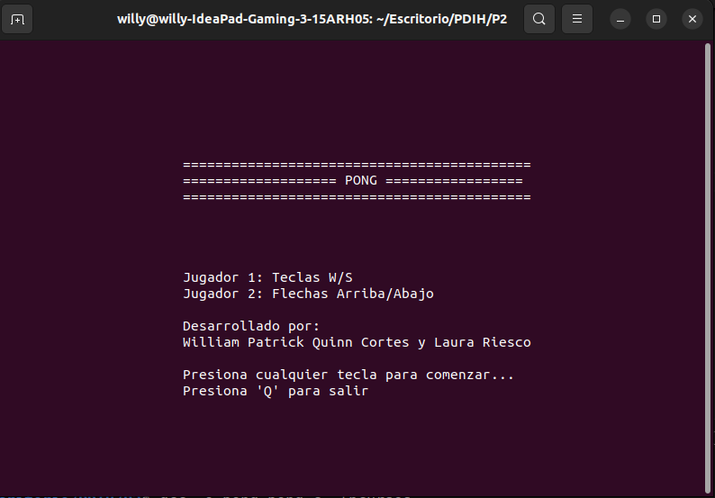
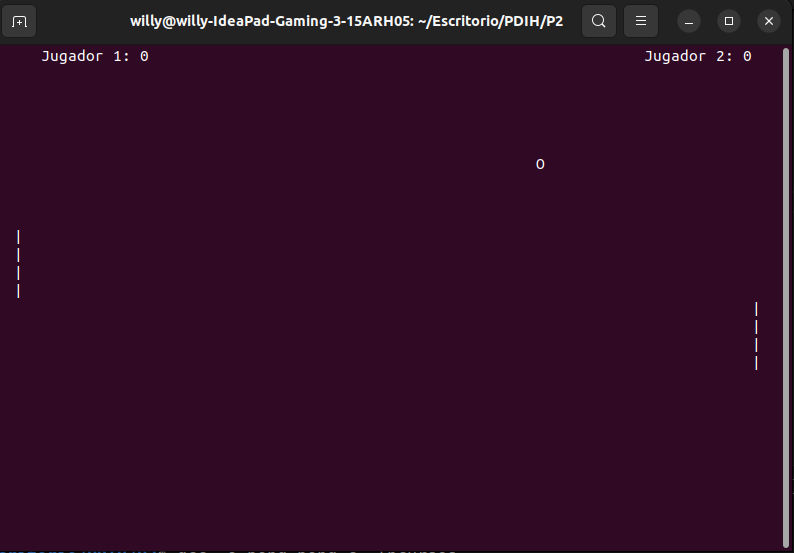
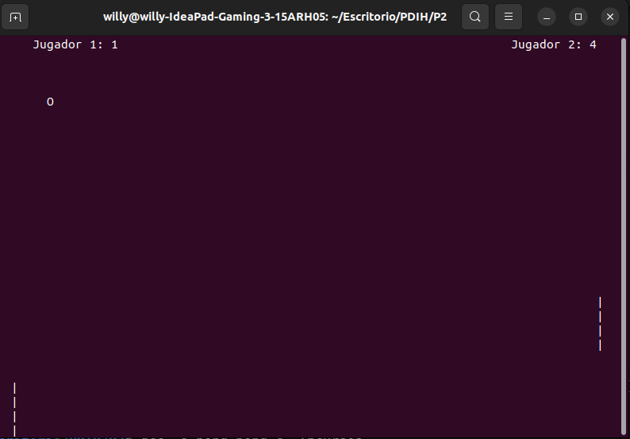
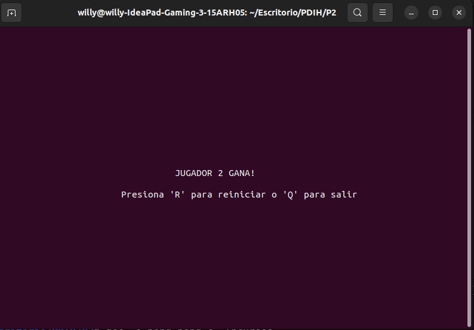

# PDIH_UGR

## Práctica 2. Uso de bibliotecas de programación de interfaces de usuario en modo texto

## Autores:
- William Quinn
- Laura Riesco

> **Nota:**
> Realizado con una division de 1 ejercicio basico cada uno. De ahi que haya mas de 1 archivo .c

## Funciones básicas

### 1. `Crear y compilar un ejemplo sencillo`
Muestra el mensaje "Hola mundo" en la terminal usando ncurses. Espera que el usuario pulse una tecla para salir.

---

### 2. `Mostrar una ventana en el terminal`
Crea una ventana de pantalla completa con un marco y fondo azul, mostrando un mensaje en su interior.

---

### 3. `Mover una pelotita en pantalla`
Muestra una letra "O" en pantalla que se puede mover con las flechas del teclado. El programa finaliza al pulsar F1.

- Antes sin mover la "pelotita"

- Despues de mover la "pelotita"

---

### 4. `Juego pong y Partes Extra`
Juego tipo Pong para dos jugadores con pelota en movimiento, pantalla de bienvenida con instrucciones, y pantalla final que muestra al ganador. Permite reiniciar o salir al finalizar.

- Pantalla de inicio
Muestra el nombre del juego, los controles para ambos jugadores y los nombres de los desarrolladores.

- Juego en curso
Se ve la pelota en movimiento, las palas, los marcadores actualizándose en tiempo real y el entorno de juego activo.

- Punto de victoria cercano
Representa un momento en el que uno de los jugadores está por ganar.

- Pantalla Final
Se indica el jugador ganador y se ofrece la opción de reiniciar el juego.

---
