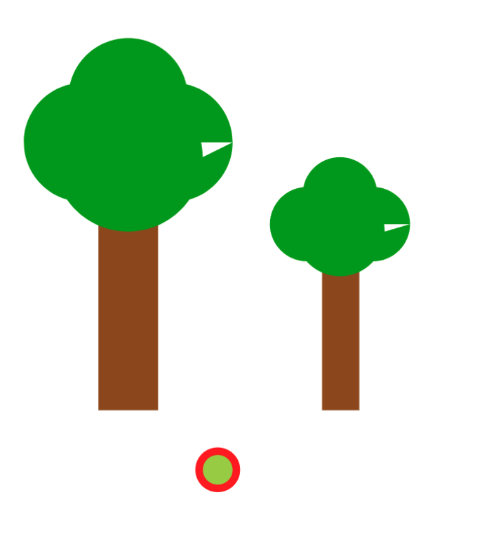
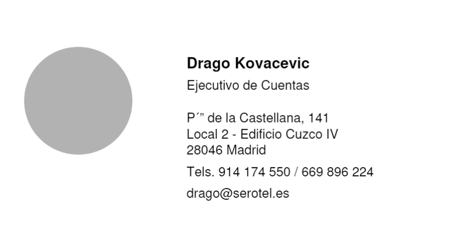
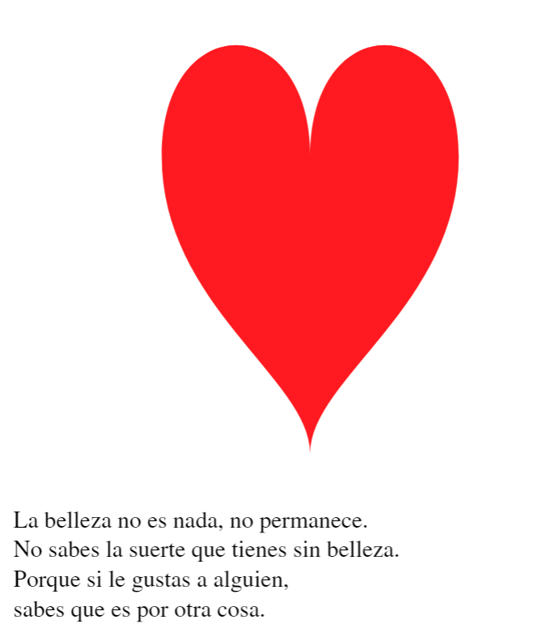
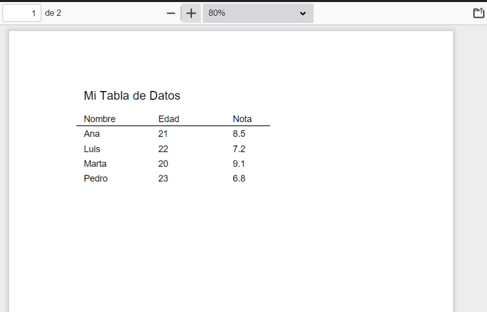
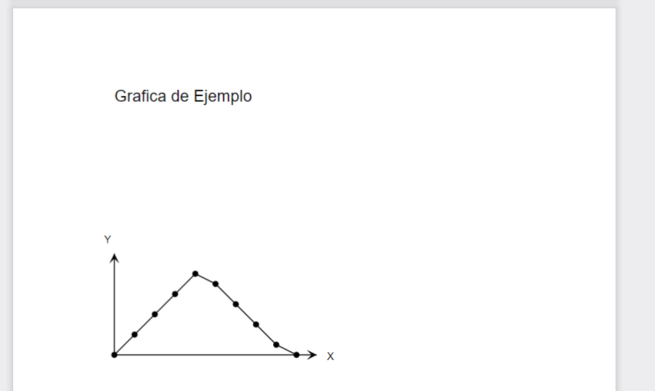

# PDIH_UGR

## Práctica 4. El lenguaje Postscript

## Autores:
- William Quinn
- Laura Riesco

> **Nota:**
> Cada ejercicio está implementado en un archivo `.ps` independiente. Las imágenes de ejemplo se encuentran en la carpeta `imgs`, los `.pdf` en la carpeta `pdfs` y los `.ps` en la carpeta `src`

---

## Ejercicios básicos

### 1. `Dibujo de árboles`
Página en la que se muestra el dibujo de unos árboles.



---

### 2. `Tarjeta de visita`
Página con el diseño de una tarjeta de visita.



---

### 3. `Corazón y poesía`
Página en la que se muestre el dibujo de un corazón y una poesía



---

## Ejercicios avanzados (opcional para subir nota)

### 1. `Sonrisa en círculos concéntricos`
Ejercicio en el que se muestre la imagen de la sonrisa, en apaisado, dentro de
una serie de círculos concéntricos de diferentes colores


---

### 2. `Tabla y gráfica en dos páginas`
Ejercicio en el que se crean dos páginas:
- **Primera página:** Muestra una tabla de datos inventados.
- **Segunda página:** Una gráfica inventada (los dos ejes y una representación gráfica sencilla en forma de cresta).

- Tabla de datos:


- Gráfica de cresta:


---

## Instrucciones

Para transformar los archivos `.ps` a `.pdf` se usó Ghostscript con el siguiente comando de ejemplo:

```powershell
& 'C:\Program Files\gs\gs10.05.1\bin\gswin64c.exe' -dBATCH -dNOPAUSE -sDEVICE=pdfwrite -sOutputFile="tabla_grafica.pdf" "tabla_grafica.ps"
```

---
