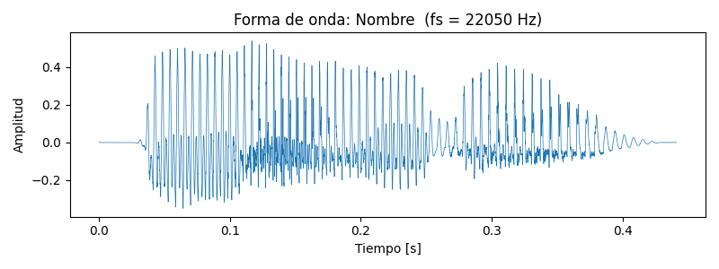
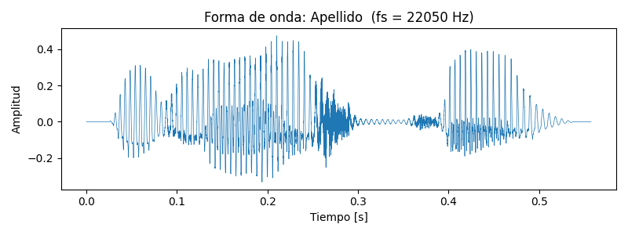
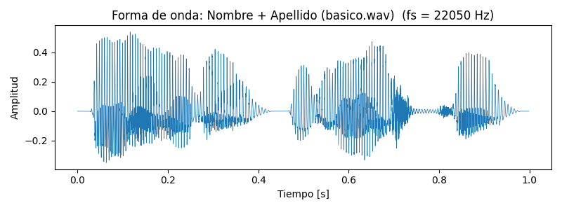
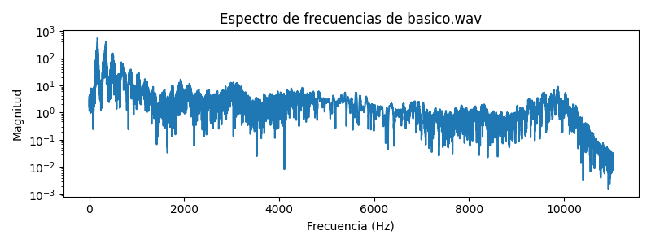
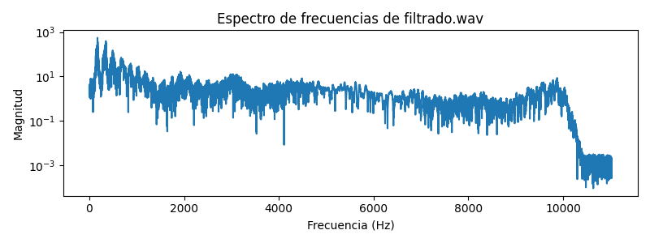

# PDIH_UGR

## Práctica 5. Procesado Digital de Sonido con Python

## Autores:
- William Quinn (parte extra)
- Laura Riesco (parte básica)

> **Nota:**
> La práctica se divide en dos scripts principales:
> - `practica_sonido.py` (parte básica, solo para macOS)
> - `practica_sonido_parteExtra.py` (parte extra, multiplataforma)
>
> **IMPORTANTE:** Para que la parte extra funcione, debes copiar los archivos WAV (`nombre.wav`, `apellido.wav`, `basico.wav`) a la carpeta `src`.

---

## Estructura de carpetas
- **src:** Contiene los archivos python para desarrollar el proyecto
- **img:** Contiene las imagenes creadas en el proyecto
- **wav:** Contiene los archivos de audio creados 

---

## Parte básica (`practica_sonido.py`)

Script realizado por Laura Riesco.  
**Solo funciona en macOS** (usa el comando `say` para sintetizar voz).

### Funcionalidades:

1. **Generación automática de archivos WAV** con tu nombre y apellido usando `say`.
2. **Visualización y guardado de la forma de onda** de cada archivo como PNG.
3. **Obtención de información de cabecera** de los archivos WAV.
4. **Concatenación de los dos archivos** en uno nuevo (`basico.wav`).
5. **Visualización y guardado de la forma de onda** del archivo concatenado.
6. **Reproducción del archivo resultante** desde el propio script.

#### Ejemplo de formas de onda generadas:

- 
- 
- 

---

## Parte extra (`practica_sonido_parteExtra.py`)

Script realizado por William Quinn.  
**Funciona en cualquier sistema operativo** (solo requiere los archivos WAV ya generados).

> **Recuerda:**  
> Antes de ejecutar este script, asegúrate de tener los archivos `nombre.wav`, `apellido.wav` y `basico.wav` en la carpeta `src`.

### Funcionalidades extra:

7. **Filtrado de frecuencias**  
   Elimina las frecuencias entre 10.000Hz y 20.000Hz de `basico.wav` y guarda el resultado como `filtrado.wav`.

   - 
   - 

   > En el espectro filtrado se aprecia que las frecuencias por encima de 10.000Hz tienden a desaparecer o tener menor magnitud, demostrando el efecto del filtro.

8. **Efecto de eco y sonido al revés**  
   - Aplica un eco a `basico.wav` y guarda el resultado como `eco.wav`.
   - Invierte el archivo con eco y lo guarda como `alreves.wav`.

---
