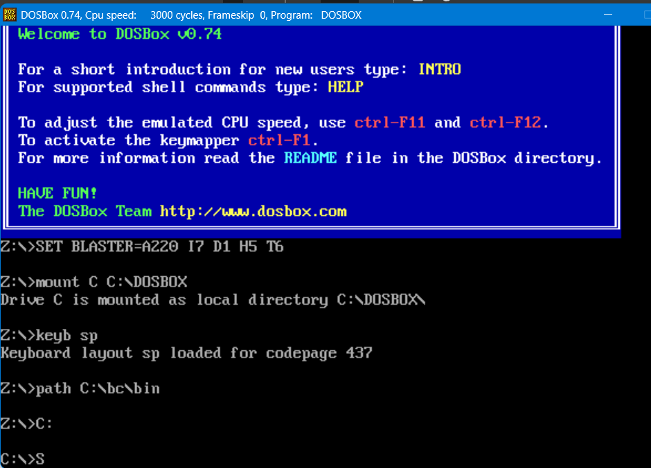
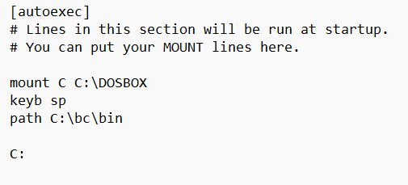
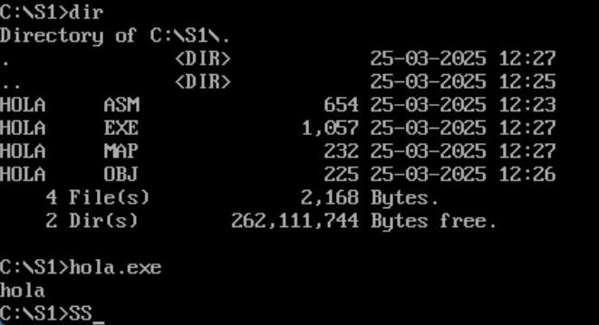
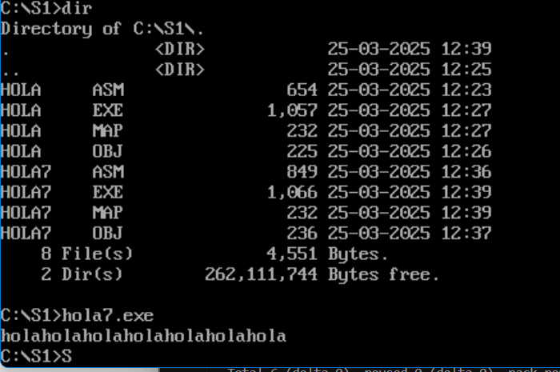

# PDIH_UGR

## Seminario 1. Programación de dispositivos a bajo nivel
## Autores:
- William Quinn
- Laura Riesco

### Inicio de Dosbox
- Iniciacion de DOSbox con su instalacion

### Configuracion DOSbox
- Archivo de configuracion de DOSbox

### Prueba Hola Mundo
- Archivo prueba Hola Mundo

### Prueba Hola Mundo 7 Iteracciones
- Archivo de hola mundo el cual se repite 7 veces

